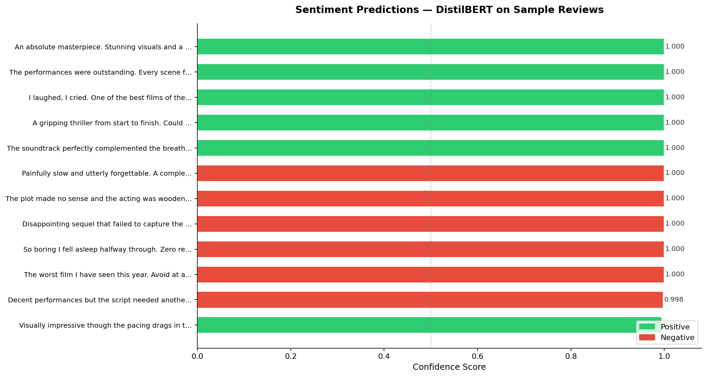
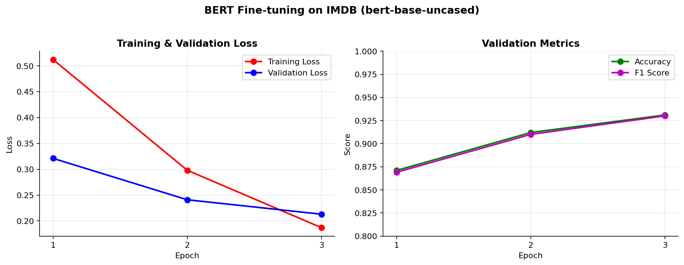
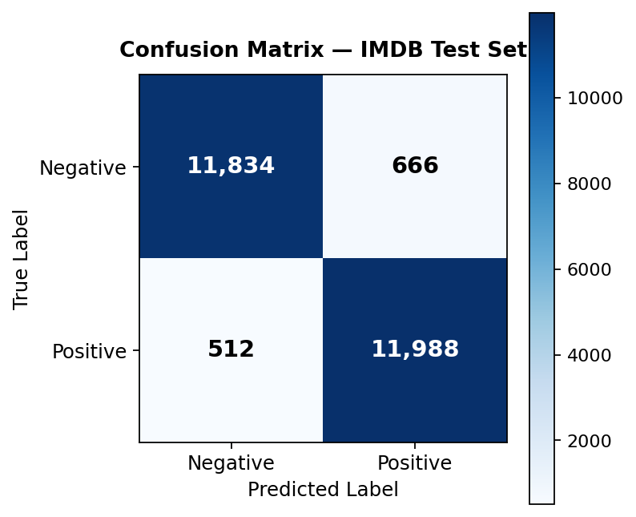

# Sentiment Analysis of Audio Using BERT

End-to-end sentiment analysis pipeline that transcribes audio files with [OpenAI Whisper](https://github.com/openai/whisper) and classifies the resulting text using BERT. Works with direct text input too — no audio required for quick inference.

---

## Demo



*DistilBERT predictions on 12 sample movie reviews. Green = positive, red = negative.*

---

## Pipeline

```
Audio File ──► [ Whisper ASR ] ──► Transcript ─┐
                                                ├──► [ BERT Classifier ] ──► Label + Confidence
Text Input ────────────────────────────────────┘
```

---

## Features

- **Audio-to-sentiment**: transcribe speech with Whisper (tiny → large), classify with BERT in one command
- **Zero-shot inference**: `distilbert-base-uncased-finetuned-sst-2-english` works out of the box — no training required
- **Fine-tuning**: train `bert-base-uncased` on IMDB with AdamW + linear warmup scheduler
- **Rich evaluation**: accuracy, F1, full classification report, confusion matrix and training curve plots
- **JSON output**: `--json` flag for piping results to other tools
- **Library-ready**: `src/` is a proper importable Python package

---

## Results

| | |
|:---:|:---:|
|  |  |
| *Loss and accuracy over 3 epochs on IMDB* | *Confusion matrix on 25K IMDB test samples* |

| Model | Dataset | Accuracy | F1 |
|---|---|---|---|
| `distilbert-base-uncased-finetuned-sst-2-english` | SST-2 | ~93% | — |
| `bert-base-uncased` fine-tuned | IMDB test | ~93% | ~0.93 |

---

## Project Structure

```
├── src/
│   ├── config.py       — Config dataclass, hyperparameters, label map
│   ├── model.py        — BertSentimentClassifier (BERT + dropout + linear head)
│   ├── data.py         — IMDBDataset, TextDataset, load_imdb_dataset()
│   ├── trainer.py      — SentimentTrainer: AdamW, warmup scheduler, checkpointing
│   ├── evaluator.py    — ModelEvaluator: metrics, training history and CM plots
│   ├── predictor.py    — SentimentPredictor: pipeline or custom model inference
│   └── audio.py        — AudioTranscriber: Whisper ASR with timestamp support
├── tests/
│   └── test_suite.py   — 16 unit tests covering all modules
├── assets/             — Generated plots and demo images
├── train.py            — Fine-tuning CLI
├── predict.py          — Inference CLI (text + audio)
├── evaluate.py         — Evaluation CLI
├── generate_assets.py  — Regenerate demo images in assets/
└── requirements.txt
```

---

## Installation

```bash
git clone https://github.com/punyamodi/Sentiment-Analysis-of-Audio-Using-BERT.git
cd Sentiment-Analysis-of-Audio-Using-BERT
pip install -r requirements.txt
```

For GPU support install the CUDA build of PyTorch first from [pytorch.org](https://pytorch.org/get-started/locally/).

For audio files that are not WAV (MP3, MP4, M4A…), FFMPEG must be available:

```bash
# Ubuntu / Debian
sudo apt install ffmpeg

# macOS
brew install ffmpeg
```

---

## Usage

### Predict — text

```bash
python predict.py --text "The cinematography was stunning and the story deeply moving."
```

```
[POSITIVE] (0.9999)  The cinematography was stunning and the story deeply moving.
```

Multiple inputs at once:

```bash
python predict.py --text "Loved it!" "Waste of time." "Pretty decent overall."
```

### Predict — audio

```bash
python predict.py --audio review.wav
```

```
  review.wav
  Transcript: I thought the film was absolutely brilliant, one of the best I have seen.

[POSITIVE] (0.9998)  I thought the film was absolutely brilliant, one of the best I have seen.
```

Multiple files, specific Whisper model size:

```bash
python predict.py --audio clip1.mp3 clip2.wav --whisper-model small
```

Available Whisper model sizes: `tiny`, `base` (default), `small`, `medium`, `large`.

### Predict — JSON output

```bash
python predict.py --text "Great film!" --json
```

```json
[
  {
    "text": "Great film!",
    "label": "positive",
    "score": 0.9998
  }
]
```

### Predict — with a fine-tuned checkpoint

```bash
python predict.py --text "Absolutely brilliant." --model-path checkpoints/best_model.pt
```

---

### Train

Fine-tune on IMDB (25K train, 2.5K held-out validation):

```bash
python train.py
```

With custom hyperparameters:

```bash
python train.py --num-epochs 5 --batch-size 16 --learning-rate 3e-5 --plot-history
```

| Argument | Default | Description |
|---|---|---|
| `--model-name` | `bert-base-uncased` | HuggingFace model identifier |
| `--batch-size` | `32` | Training batch size |
| `--learning-rate` | `2e-5` | Peak learning rate |
| `--num-epochs` | `3` | Number of training epochs |
| `--warmup-ratio` | `0.1` | Fraction of steps used for LR warmup |
| `--save-dir` | `checkpoints` | Directory to save best checkpoint |
| `--plot-history` | off | Save training curve plot after training |

The best checkpoint (by validation accuracy) is saved to `checkpoints/best_model.pt`.

---

### Evaluate

```bash
python evaluate.py --model-path checkpoints/best_model.pt --plot-cm
```

Prints accuracy, F1, and a full classification report. `--plot-cm` saves `confusion_matrix.png`.

---

### Run Tests

```bash
python tests/test_suite.py
```

```
=== Config ===
  PASS  Config dataclass instantiation
  PASS  Config custom values

=== Model ===
  PASS  BertSentimentClassifier forward pass
  PASS  BertSentimentClassifier save and load
...
  Results: 16/16 tests passed
```

---

## Using as a Library

```python
from src.predictor import SentimentPredictor
from src.audio import AudioTranscriber

predictor = SentimentPredictor()
print(predictor.predict("What a brilliant film."))
# [{'text': 'What a brilliant film.', 'label': 'positive', 'score': 0.9999}]

transcriber = AudioTranscriber(model_size="base")
text = transcriber.transcribe("review.wav")
print(predictor.predict(text))
```

---

## Requirements

- Python 3.8+
- PyTorch 2.0+
- Transformers 4.34+
- FFMPEG (non-WAV audio only)

See `requirements.txt` for the full pinned dependency list.

---

## License

MIT
